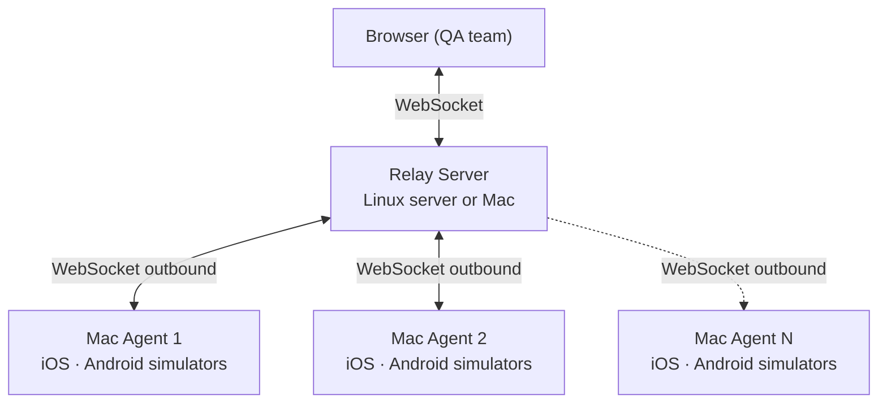

# Introduction

**tapflow** lets your QA team run iOS simulators and Android emulators directly in the browser — without Appetize, BrowserStack, or any external cloud.

<video controls style="width: 100%; border-radius: 8px; margin: 1.5rem 0;">
  <source src="https://github.com/jo-duchan/tapflow/releases/download/demo-assets/tapflow-demo-final-compressed.mp4" type="video/mp4">
</video>

## Why tapflow?

| Solution | Problem |
|----------|---------|
| Appetize / BrowserStack | Expensive, app data leaves your network |
| Physical devices | Cost, loss, management overhead |
| Xcode / Android Studio directly | Every QA team member needs their own Mac + Xcode or Android Studio setup |
| tapflow | Use infra you already own, data stays on-prem |

## How it works

1. A **Mac Agent** connects outbound to the relay — no inbound firewall rules needed.
2. QA opens the dashboard in any browser and sees all available devices.
3. Touch events are forwarded in real time; the screen streams back to the browser.

::: info Streaming format by platform
- **iOS** Simulator: JPEG frames (~30 fps)
- **Android** Emulator: H.264 stream (~30 fps, scrcpy-based)

Visual quality and latency may differ between the two.
:::

## Key concepts

- **Relay** — the central server. Routes traffic between agents and browsers. Deploy once.
- **Agent** — runs on Mac (iOS and Android). Connects to the relay.
- **Dashboard** — the React SPA served by the relay. No separate deploy needed. Includes App Center (build management), Mac Resources (agent monitoring), and more.
