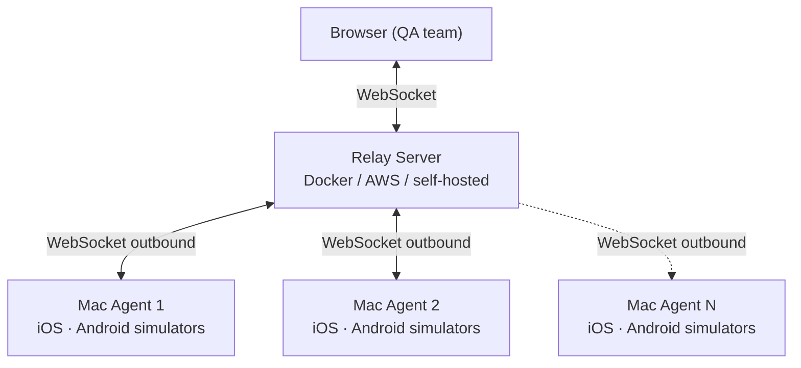

# Introduction

**tapflow** lets your QA team run iOS simulators and Android emulators directly in the browser — without Appetize, BrowserStack, or any external cloud.

## Why tapflow?

| Solution | Problem |
|----------|---------|
| Appetize / BrowserStack | Expensive, app data leaves your network |
| Physical devices | Cost, loss, management overhead |
| Xcode Simulator directly | QA team needs Mac + Xcode installed |
| tapflow | Use infra you already own, data stays on-prem |

## How it works

1. A **Mac Agent** connects outbound to the relay — no firewall rules needed.
2. QA team opens the dashboard in any browser and sees all available simulators and emulators.
3. Touch events are forwarded in real time; the screen streams back as JPEG frames (~30 fps).

## Key concepts

- **Relay** — the central server. Routes traffic between agents and browsers. Deploy once.
- **Agent** — runs on Mac (iOS and Android). Connects to the relay.
- **Dashboard** — the React SPA served by the relay. No separate deploy needed.
- **App Center** — upload `.app.zip` (iOS) or `.apk` (Android) builds; QA picks a build and device to start a session.
