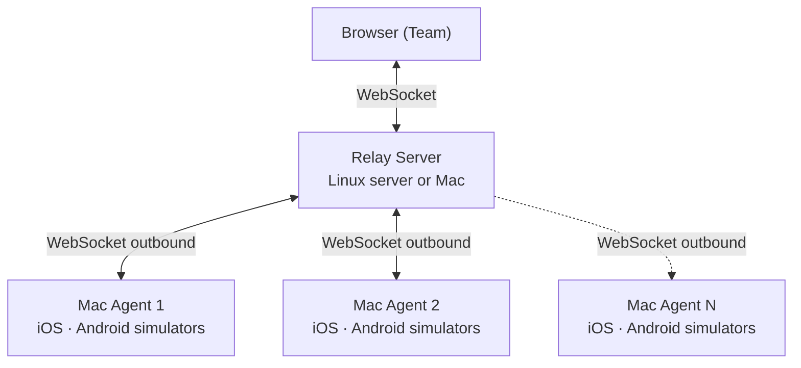

# Introduction

**tapflow** lets your entire team run mobile QA directly in the browser — no developer tools, no device management, no external cloud.

<VideoPlayer src="/tapflow-demo.mp4" poster="/demo-thumbnail.png" />

## Why tapflow?

| Solution | Problem |
|----------|---------|
| Appetize / BrowserStack | Expensive, app data leaves your network |
| Physical devices | Cost, loss, management overhead |
| Xcode / Android Studio directly | Every team member needs their own Mac + Xcode or Android Studio setup |
| tapflow | Use infra you already own, data stays on-prem |

In short, tapflow is a self-hosted, open-source alternative to cloud testing services like Appetize and BrowserStack App Live — the same browser-based mobile QA, but builds and test data stay on infrastructure you already own.

## How it works

1. A **Mac Agent** connects outbound to the relay — no inbound firewall rules needed.
2. Team opens the dashboard in any browser and sees all available devices.
3. Touch events are forwarded in real time; the screen streams back to the browser.

::: info Streaming format by platform
- **iOS** Simulator: JPEG frames (~30 fps)
- **Android** Emulator: H.264 stream (~30 fps, scrcpy-based)

Visual quality and latency may differ between the two.
:::

## Key concepts

- **Relay** — the central server. Routes traffic between agents and browsers. Run once.
- **Agent** — runs on Mac (iOS and Android). Connects to the relay.
- **Dashboard** — the React SPA served by the relay. No separate deploy needed. Includes App Center (build management), Mac Resources (agent monitoring), and more.
- **MCP Server** — exposes tapflow as a tool for LLM agents. Claude Code and other MCP-compatible agents can control simulators directly. → [MCP Server guide](/guide/mcp-server)
