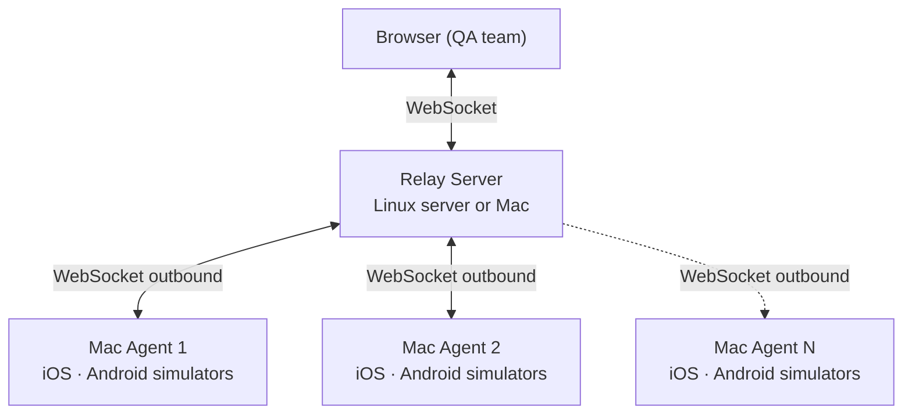

# Scaling Mac Resources

tapflow scales horizontally — add more Mac hosts to the same relay to expand your device pool. Each Mac runs its own agent and connects outbound to the relay, so no firewall changes are required.

## How it works



The dashboard shows all devices from all connected agents in a single list. QA picks any available device — tapflow routes the session to the right Mac automatically.

## Adding a second Mac

::: tip The relay must be reachable from all Macs
When running `tapflow agent start` on another Mac, `ws://localhost:4000` resolves to that Mac's own localhost — not the relay machine. Use the relay's actual network address: a local IP (`ws://192.168.x.x:4000`) for the same LAN, or a public URL for agents on different networks. See [Self-Hosting the Relay](/guide/self-hosting).
:::

On the new Mac, install tapflow and point it at your existing relay:

```sh
npm install -g tapflow
tapflow agent start --relay wss://your-relay-url
```

That's it. The new Mac registers itself and its devices become visible in the dashboard immediately.

## Agent names

Each agent uses the Mac's hostname as its display name in the dashboard. To see which agent is which:

```sh
tapflow status --relay wss://your-relay-url
```

```
  ● mac-mini-office
      ○  iPhone 16 Pro
      ○  iPhone 15

  ● mac-mini-lab
      ○  iPhone 14
      ○  Pixel 8
```

The agent name is derived from the Mac's system hostname (`scutil --get ComputerName` on macOS). To change it, update the hostname in **System Settings → General → Sharing → Computer Name**.

## How many simulators per Mac?

iOS Simulator and Android Emulator are memory-intensive. The number you can run simultaneously depends on your Mac's RAM and CPU.

Simulators are booted and managed through the dashboard. The agent reports only booted simulators to the relay, so QA sees exactly what's available.

## Monitoring

Track CPU and RAM usage per agent from the **Mac Resources** tab in the dashboard.
Each host appears as a separate card with a time-series chart (1h / 6h / 24h / 7d).

For a quick CLI check:

```sh
tapflow status --relay wss://your-relay-url
```
