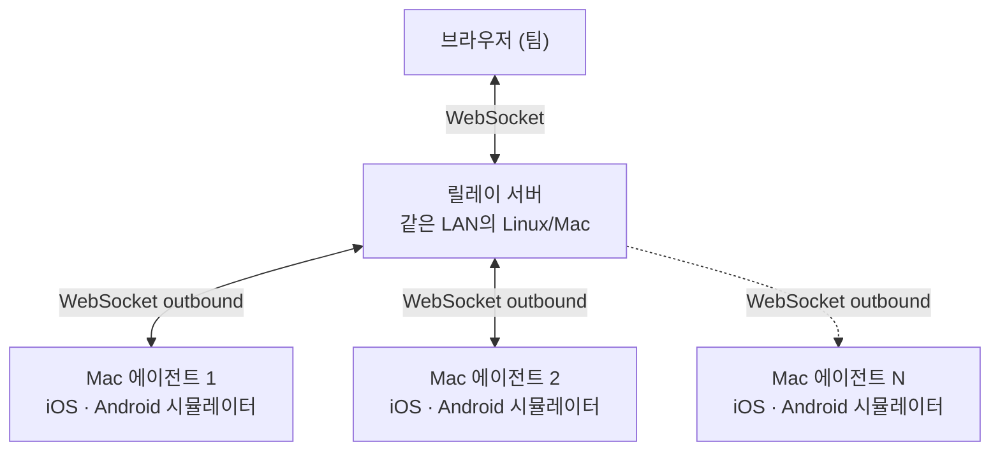

# 소개

**tapflow**를 사용하면 팀 누구나 iOS 시뮬레이터와 Android 에뮬레이터를 브라우저에서 직접 실행할 수 있습니다. 별도 도구 설치도, 기기 관리도, 외부 클라우드도 필요하지 않습니다.

<VideoPlayer src="/tapflow-demo.mp4" poster="/demo-thumbnail.png" />

## 왜 tapflow인가요?

| 솔루션 | 문제점 |
|--------|--------|
| Appetize / BrowserStack | 비용이 비싸고, 앱 데이터가 외부 네트워크로 유출됨 |
| 실제 디바이스 | 구매 비용, 분실·파손 위험, 관리 오버헤드 |
| Xcode / Android Studio 직접 사용 | 각 팀원이 Mac + Xcode 또는 Android Studio 설정 필요 |
| tapflow | 이미 보유한 인프라 활용, 데이터 온-프레미스 유지 |

요약하면, tapflow는 Appetize, BrowserStack App Live 같은 클라우드 테스트 서비스를 대체하는 오픈소스 셀프호스팅 도구입니다. 브라우저 기반 모바일 QA는 그대로 제공하되, 빌드와 테스트 데이터는 이미 보유한 인프라 안에 남습니다.

## 동작 원리

1. **Mac 에이전트**가 릴레이에 아웃바운드로 연결합니다. 인바운드 방화벽 규칙이 필요 없습니다.
2. 팀원은 브라우저에서 대시보드를 열어 사용 가능한 디바이스를 확인합니다.
3. 터치 이벤트는 실시간으로 전달되고, 화면은 브라우저로 스트리밍됩니다.

::: info 플랫폼별 스트리밍 방식
- **iOS** 시뮬레이터: H.264 스트리밍 (~30fps; 구형 브라우저는 JPEG 폴백)
- **Android** 에뮬레이터: H.264 스트리밍 (~30fps)

두 방식의 화질·지연감이 다를 수 있습니다. 해상도와 디코더는 각 시청자의 연결에 따라 자동으로 조정됩니다 — [스트림 품질](/ko/guide/streaming) 참고.
:::

## 핵심 개념

- **Relay** — 중앙 서버. 에이전트와 브라우저 사이의 트래픽을 라우팅합니다. 한 번만 실행하면 됩니다.
- **Agent** — Mac에서 실행됩니다 (iOS 및 Android). 릴레이에 연결합니다.
- **Dashboard** — 릴레이가 서빙하는 React SPA. 별도 배포가 필요 없습니다. App Center(빌드 관리), Mac Resources(에이전트 모니터링) 등의 페이지로 구성됩니다.
- **MCP Server** — tapflow를 LLM 에이전트 도구로 제공합니다. Claude Code 등에서 시뮬레이터를 직접 조작할 수 있습니다. → [MCP 서버 가이드](/ko/guide/mcp-server)
